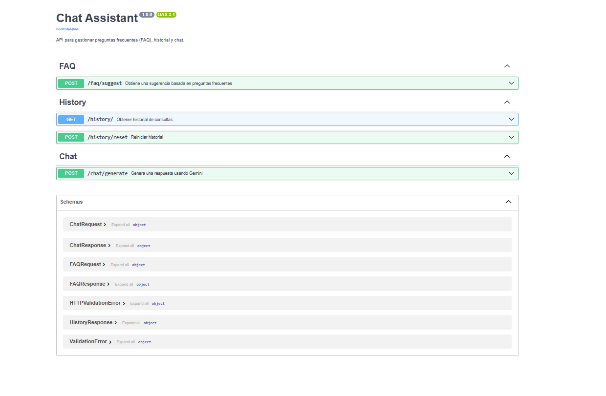

# FAQ & AI Chat Assistant System


A FastAPI-based system that provides automated FAQ suggestions and integrates with Google's Gemini AI for chat functionality.

## Features

- **FAQ Suggestions**: Automatic responses based on a knowledge base
- **Chat with Gemini AI**: Integration with Google's generative AI
- **Greeting Detection**: Automatic response to common greetings
- **History Tracking**: In-memory query history storage
- **Docker Support**: Easy containerization

## Table of Contents

- [Prerequisites](#prerequisites)
- [Installation](#installation)
- [Configuration](#configuration)
- [Running the Application](#running-the-application)
- [API Endpoints](#api-endpoints)
- [Docker Deployment](#docker-deployment)
- [Testing](#testing)


---

## Prerequisites

- Python 3.9+
- Docker (optional)
- Google API Key (for Gemini integration)
- [Get Gemini API Key](https://ai.google.dev/)

---

## Installation

1. Clone the repository:
```bash
git clone https://github.com/your-username/faq-chat-system.git
cd faq-chat-system

2. Create and activate virtual environment:
```bash
python -m venv venv
source venv/bin/activate
```

3. Install dependencies:
```bash
pip install -r requirements.txt
```

## Configuration
1. Create .env file with your Gemini API key:

1. Create `.env` file with your Gemini API key:
```bash
GEMINI_API_KEY=your-api-key
```

2. add environment variables to `.env` file:
```bash
GEMINI_API_KEY=your-api-key
```

3. Create `data/dataChat.json` file with your FAQ questions:
```json
[
    {
        "pregunta": "¿Cómo cambio mi contraseña?",
        "respuesta": "Puedes cambiar tu contraseña en la sección de configuración de tu perfil."
    },
    {
        "pregunta": "¿Cuál es el horario de atención?",
        "respuesta": "Nuestro horario es de lunes a viernes de 8 am a 5 pm."
    }
]
```

## Running the Application

```bash
uvicorn main:app --reload
```

## API Endpoints

### FAQ

#### GET /faq/suggest

Access the API at: http://localhost:8000/docs
Endpoint to suggest FAQ answers based on user queries.

## Docker Deployment

To deploy the application using Docker, follow these steps:

1. Build the Docker image:
```bash
docker build -t faq-chat .
```

2. Run the Docker container:
```bash
docker run -p 8000:8000 faq-chat
```

3.  verify the container is running:
```bash
docker ps
```

## API Endpoints

### FAQ

#### GET /faq/suggest

Access the API at: http://localhost:8000/docs
Endpoint to suggest FAQ answers based on user queries.

### History

#### GET /history

Access the API at: http://localhost:8000/docs
Endpoint to get the history of user queries and their corresponding suggestions.

#### POST /history/reset

Access the API at: http://localhost:8000/docs
Endpoint to reset the history of user queries and their corresponding suggestions.

### Chat

#### POST /chat/generate

Access the API at: http://localhost:8000/docs
Endpoint to generate a chat response based on user queries and context.

## Testing

To run the tests, follow these steps:

1. Run all tests:
```bash
pytest -v tests/
```  
2. Run specific test:
```bash
pytest -v tests/test_faq.py
pytest -v tests/test_history.py
pytest -v tests/test_chat.py
```

## Documentation

The API documentation is available at: http://localhost:8000/docs   

## Project Structure

```
├── Dockerfile
├── LICENSE
├── README.md
├── config
│   ├── config.py
│   └── utils.py
├── data
│   └── dataChat.json
├── main.py
├── requirements.txt
├── tests    
│   ├── test_chat.py
│   ├── test_faq.py
│   └── test_history.py
└── api
    ├── routes
    │   ├── chat.py
    │   ├── faq.py
    │   └── history.py
    └── schemas
        ├── base.py
        ├── chat.py
        ├── faq.py
        └── history.py
```
